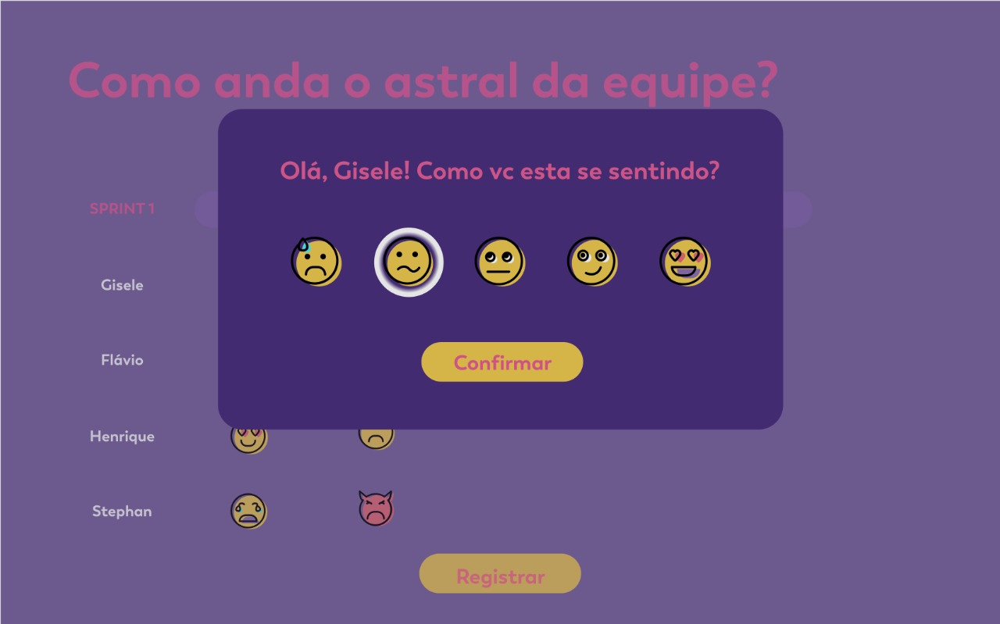

[](https://travis-ci.org/nikoniko-team/nikoniko-front)


# nikoniko-front

### SandBox for Testing (Branch master)
- https://sandbox-nikoniko-front.herokuapp.com/

### Production (Branch production)
- https://production-nikoniko-front.herokuapp.com/

Back-end Repository
- https://github.com/nikoniko-team/nikoniko-backend


### Design example:


## Project setup
```
yarn install
```

### Compiles and hot-reloads for development
```
yarn run serve
```

### Compiles and minifies for production
```
yarn run build
```

### Run your tests
```
yarn run test
```

### Lints and fixes files
```
yarn run lint
```

### Customize configuration
See [Configuration Reference](https://cli.vuejs.org/config/).


